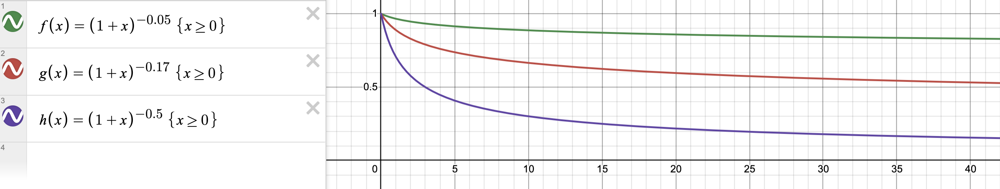
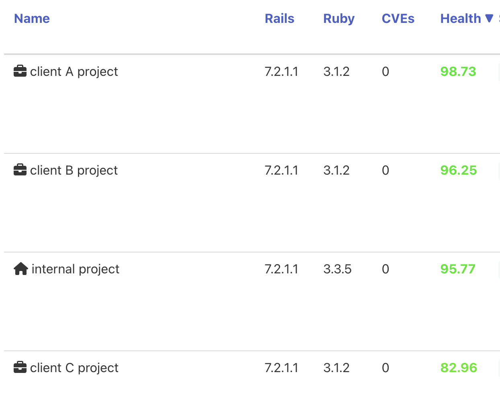
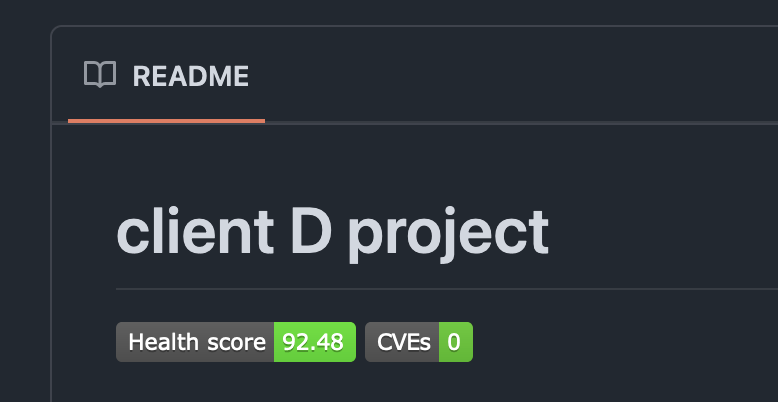

# Polariscope 🔬

Polariscope is a Ruby gem to evaluate the overall health of your Ruby application by analyzing its dependencies. It calculates a [health score](#health-score-formula) based on which dependencies are outdated and vulnerable to security issues.

Keeping dependencies up-to-date is crucial for maintaining application security, performance, and compatibility. This gem provides a quick and easy way to gauge the state of your project's dependencies and take measures to improve its health (more on this in the [Motivation section](#motivation)).

Think of this gem as a way to score outputs of `bundle outdated` and `bundle-audit check`.

## Installation

Add it to your Gemfile:

    $ bundle add polariscope

or install standalone:

    $ gem install polariscope

## Usage

Polariscope can be used on the CLI and in code.

### CLI

Position yourself at the root of your Ruby application and run:

    $ [bundle exec] polariscope scan
    => 87.4

The command will read the contents of `Gemfile`, `Gemfile.lock` and [`.bundler-audit.yml`](https://github.com/rubysec/bundler-audit?tab=readme-ov-file#configuration-file) (optional, to ignore advisories) in the current directory and output the calculated health score.

### In code

```ruby
health_score = Polariscope.scan
```

Without arguments, it will do the same as above. Optionally, you can override various parameters:

```ruby
Polariscope.scan(
  gemfile_content: '', # e.g. File.read('Gemfile')
  gemfile_lock_content: '', # e.g. File.read('Gemfile.lock')
  bundler_audit_config_content: '', # e.g. File.read('.bundler-audit.yml')
  spec_type: :latest, # see https://docs.ruby-lang.org/en/master/Gem/SpecFetcher.html#method-i-available_specs
  dependency_priorities: { ruby: 5.0, devise: 10.0 }, # hash of dependency priorities
  group_priorities: { default: 5.0, test: 2.0 }, # hash of bundler group priorities
  default_dependency_priority: 2.0,
  advisory_severity: 1.09, # number >= 1
  advisory_penalties: { medium: 2.0, critical: 5.0 }, # hash of advisory penalties by criticality
  fallback_advisory_penalty: 2.0, # used if value not found in previous hash
  major_version_penalty: 0.5, # number in range [0, 1]
  new_versions_severity: 1.09, # number >= 1
  segment_severities: [1.7, 1.15, 1.01], # ordered by segments: [major, minor, patch]
  fallback_segment_severity: 1.01, # in case dependency versions have more segments than in segment_severities
)
```

For details on what these parameters mean, consult [this section](#health-score-formula).

#### Additional features

Get the released or latest version of gems with:

```ruby
# released versions
gem_specs = Polariscope.gem_versions(['devise', 'pundit'])
gem_specs.versions_for('devise')
# => returns potentially many versions

# latest version
gem_specs = Polariscope.gem_versions(['devise', 'punt'], spec_type: :latest)
gem_specs.versions_for('pundit')
# => returns only the latest version
```

## Health Score Formula

Health score is calculated with a formula that takes the contents of `Gemfile` and `Gemfile.lock` and produces a decimal number in the $[0,100]$ range. 100 means everything is up-to-date and there are no security issues, and it lowers as newer versions are released or security issues are discovered.

By design, health score is most useful as a relative measure of application health: if your health score suddenly drops one day from 100 to 90, it signals a serious issue (e.g. a new vulnerability in your Ruby version). If it drops from 100 to 95, it may signal that a new minor version of Rails has been released, for example. If it drops from 100 to 99.5, it may mean a gem like Pundit has a new patch version with a bug fix.

How much the score changes depends on various factors:
- dependency priority (by default, [Ruby and Rails have a higher priority](https://github.com/infinum/polariscope/blob/master/lib/polariscope/scanner/calculation_context.rb#L6) than other dependencies)
- [bundler group](https://bundler.io/guides/groups.html) priority (by default, [`:default` and `:production` groups have a higher priority](https://github.com/infinum/polariscope/blob/master/lib/polariscope/scanner/calculation_context.rb#L7))
- number of versions between the current and the latest version of a dependency
- the kind of outdatedness according to [SemVer](https://semver.org/); if there's a new major version, that will cause a sharper drop in the score than a new minor version
- the number of active security advisories
- [advisory severity](https://nvd.nist.gov/vuln-metrics/cvss) (e.g. a High severity advisory will cause a sharper drop in score than one that is Low)

### Formula

[This is the complete formula](https://github.com/infinum/polariscope/blob/master/lib/polariscope/scanner/gemfile_health_score.rb#L22) (it's simpler than it may seem):
```math
{HS}_G =
100
\cdot
\underbrace{\left(1-\frac{\sum_{d \in G_{dd}}w_d \cdot mp_d}{\sum_{d \in G_{dd}}w_d}\right)}_{\text{major versions score}}
\cdot
\underbrace{\left(\frac{\sum_{d \in G_{dd}}w_d \cdot {dhs}_d}{\sum_{d \in G_{dd}}w_d}\right)}_{\text{versions score}}
\cdot
\underbrace{\left(1 +\sum_{d \in G} \sum_{a \in d} p_a\right)^{-\ln{S_A}}}_{\text{advisories score}}
```

```math
\begin{array}{ll}
G & \text{Gemfile} \\
G_{dd} & \text{subset of Gemfile with direct dependencies only} \\
d & \text{dependency} \\
\dotso & \text{see below for other symbols}
\end{array}
```

It's comprised of several scores in the $[0,1]$ range multiplied together and then finally by 100 to produce the final score. Score formulas are described in the following sections.

Note that, by design, health score can never be higher than the lowest of its scores. For example, if your major versions score is 0.75, then health score can never be higher than 75, regardless of other scores being 1.

### Major versions score

Score that signals how many dependencies have outdated major versions (it doesn't care about minor or patch versions). Score 1 means no dependency has an outdated major while score 0 means all have an outdated major. Other combinations fall in between those extremes.

[The formula](https://github.com/infinum/polariscope/blob/master/lib/polariscope/scanner/gemfile_health_score.rb#L30-L36) $1-\frac{\sum_{d \in G_{dd}}w_d \cdot mp_d}{\sum_{d \in G_{dd}}w_d}$ starts with score 1 and is subtracted by the [weighted arithmetic mean](https://en.wikipedia.org/wiki/Weighted_arithmetic_mean) of major version penalties for all direct dependencies (only dependencies specified in the `Gemfile` and not dependencies of dependencies present in `Gemfile.lock`). The penalty controls how much the score drops when the major of a dependency is outdated, and the priority proportions that penalty in relation to other dependencies.

[Dependency priority (weight)](https://github.com/infinum/polariscope/blob/master/lib/polariscope/scanner/calculation_context.rb#L40-L44) $w_d$ is set to either a custom dependency priority, bundler group priority if dependency doesn't have a custom priority, or default priority if dependency's group doesn't have a defined priority ([default values](https://github.com/infinum/polariscope/blob/master/lib/polariscope/scanner/calculation_context.rb#L6-L8)).

[Major version penalty](https://github.com/infinum/polariscope/blob/master/lib/polariscope/scanner/gem_health_score.rb#L21-L23) ${mp}_d$ is a number in range $[0,1]$; [by default](https://github.com/infinum/polariscope/blob/master/lib/polariscope/scanner/calculation_context.rb#L20) it equals 1. When the major isn't outdated, there is no penalty (penalty equals 0).

### Versions score

Score that represents how outdated direct dependencies are based on the number of new versions and the kind of outdatedness. Score 1 means all dependencies are up-to-date. As dependencies get outdated, it starts to lower. Unlike major versions score, this score can never reach 0, it only gravitates towards it.

[The formula](https://github.com/infinum/polariscope/blob/master/lib/polariscope/scanner/gemfile_health_score.rb#L38-L40) $`\frac{\sum_{d \in G_{dd}}w_d \cdot {dhs}_d}{\sum_{d \in G_{dd}}w_d}`$ is a weighted arithmetic mean of dependency health scores. Same dependency priority $w_d$ is used as for major versions score.

[Dependency health score](https://github.com/infinum/polariscope/blob/master/lib/polariscope/scanner/gem_health_score.rb#L15-L18) ${dhs}_d$ is calculated with the following formula:
```math
{dhs}_d=
\underbrace{(1+{sp}_d)^{-\ln{{ss}_d}}}_{\text{segment subscore}}
\cdot
\underbrace{(1+{vp}_d)^{-\ln{S_{V}}}}_{\text{versions subscore}}
```

Both subscores use a version of the power function. See [this section](#penalty-and-severity-function) for more details on its interpretation.

#### Segment subscore

[Score](https://github.com/infinum/polariscope/blob/master/lib/polariscope/scanner/gem_health_score.rb#L16) in the $(0,1]$ range that represents how outdated is the **first** outdated segment (major, minor or patch) of a dependency. When the current version is also the latest, the score equals 1, and it starts to drop towards 0 with the release of new versions.

[Segment penalty](https://github.com/infinum/polariscope/blob/master/lib/polariscope/scanner/gem_health_score.rb#L43-L45) ${sp}_d$ is defined as the number of new versions for the first outdated segment. Take this example: your dependency is on `v1.0.0`, but `v1.1.0`, `v2.0.0` and `v3.0.0` have been released in the meantime. The first outdated segment is major (minor is also outdated, but it comes after major, so it's not the first). ${sp}_d$ is then the number of new majors, in this case 2.

[Segment severity](https://github.com/infinum/polariscope/blob/master/lib/polariscope/scanner/gem_health_score.rb#L35-L37) ${ss}_d$ is a number selected based on the first outdated segment. Default list of severities can be found [here](https://github.com/infinum/polariscope/blob/master/lib/polariscope/scanner/calculation_context.rb#L22) (order `[major, minor, patch]`). For example, if major is outdated, first value in the list is used.

#### Versions subscore

[Score](https://github.com/infinum/polariscope/blob/master/lib/polariscope/scanner/gem_health_score.rb#L17) in the $(0,1]$ range that represents how many new versions have been released for the dependency since the current version.  When the current version is also the latest, the score equals 1, and it lowers with every new version.

Penalty $`{vp}_d`$ is defined as the total number of versions between the current and the latest version (inclusive). Severity $`S_{V}`$ is a constant ([default value](https://github.com/infinum/polariscope/blob/master/lib/polariscope/scanner/calculation_context.rb#L21)).

### Advisories score

Score in the $(0,1]$ range that represents how many security advisories impact your dependencies, taking into account their severities. Unlike previous scores, this score looks at all dependencies, direct or indirect (basically, everything in `Gemfile.lock`). Score 1 means no dependency has an active advisory, and it drops with each new advisory.

[The formula](https://github.com/infinum/polariscope/blob/master/lib/polariscope/scanner/advisories_health_score.rb#L12) $\left(1 +\sum_{d \in G} \sum_{a \in d} p_a\right)^{-\ln{S_A}}$ in essence sums advisory penalties $p_a$ for all advisories of all dependencies (+1) and raises it to some power. See the next section for a detailed explanation.

[Advisory penalty](https://github.com/infinum/polariscope/blob/master/lib/polariscope/scanner/calculation_context.rb#L46-L48) $p_a$ is a number selected based on the criticality (severity score mapped to a name) of the advisory ([default mapping](https://github.com/infinum/polariscope/blob/master/lib/polariscope/scanner/calculation_context.rb#L11-L17)). Generally, a higher criticality results in a higher penalty. If criticality is unknown, fallback penalty is used ([default value](https://github.com/infinum/polariscope/blob/master/lib/polariscope/scanner/calculation_context.rb#L18)). Severity $S_A$ is a constant ([default value](https://github.com/infinum/polariscope/blob/master/lib/polariscope/scanner/calculation_context.rb#L10)).

### Penalty and severity function

Function used for several scores is of type $f(x)=(1+x)^{-S}$, where $S$ is some positive constant.

See this graph for various values $S$ (we'll focus on case $x\ge0$):

and notice several interesting properties:
1. $f(0)=1$
2. $f(x+1) \lt f(x)$
3. $\lim_{x \to \infty} f(x)=0$
4. bigger $S$ -> more severe "drop"

The function returns values in range $(0,1]$ (props 1-3). It begins with value 1 (prop 1) which drops the further away we move from $x=0$ (prop 2). Property 4 allows us to control how quickly the value drops.

This can be used as a simple but an okay way to model certain scores. For scoring purposes we will refer to $x$ as penalty and $S$ as severity. Take for example the [versions subscore](#versions-subscore), which uses this function: penalty is the number of new versions for a dependency, so the more new versions there are, the lower the score.

$^*$ In all formulas, severity is a natural logarithm $ln$ of some constant greater than 1. This is purely because actual constants $S$ need to be small enough (smaller than 0.1) to not cause too sharp a drop in the score too fast. It's easier to work with bigger numbers, so instead of $(1+x)^{-S}$ we work with $(1+x)^{-\ln(S)}$.

## Motivation

Who is this tool for? What does it accomplish?

Agencies like [Infinum](https://infinum.com/) are at any point in time working on multiple projects, e.g. multiple Ruby applications. Without a monitoring process, it would be necessary to manually check each project for security vulnerabilities and new dependency versions (e.g. a new major version with a breaking change). With scale, this becomes time-consuming.

Health score is a way to monitor these things. Instead of manually checking each project for outdated dependencies (output of `bundle outdated`) and security advisories (output of `bundle-audit check`), health score informs you whether those outputs require immediate action.

As was said above, health score is most useful as a relative measure. It starts at value 100 and it drops as new versions/security issues arise. Your project might have a score of 99 one day, but suddenly drop to 90 the next — this signals something significant happened, probably a security advisory in an important dependency like Rails, or a new major version of Ruby. On the other hand, if it drops from 99 to 97, it could mean some dependency has a new minor version.

It's up to you to decide when to take action: either when the score drops suddenly (to fix immediate issues) or when it drops below a certain threshold (to update multiple dependencies in one go).

At Infinum, Polariscope is used as part of a monitoring tool that (among other things) calculates health scores for all Ruby projects daily. Part of the project table looks like this:<br />


The health score is also shown as a badge on the repository README:<br />


## Development

After checking out the repo, run `bin/setup` to install dependencies. Then, run `rake spec` to run the tests. You can also run `bin/console` for an interactive prompt that will allow you to experiment.

To install this gem onto your local machine, run `bundle exec rake install`. To release a new version, update the version number in `version.rb`, and then run `bundle exec rake release`, which will create a git tag for the version, push git commits and the created tag, and push the `.gem` file to [rubygems.org](https://rubygems.org).

## Contributing

Bug reports and pull requests are welcome on GitHub at https://github.com/infinum/polariscope.

## License

The gem is available as open source under the terms of the [MIT License](https://opensource.org/licenses/MIT).
